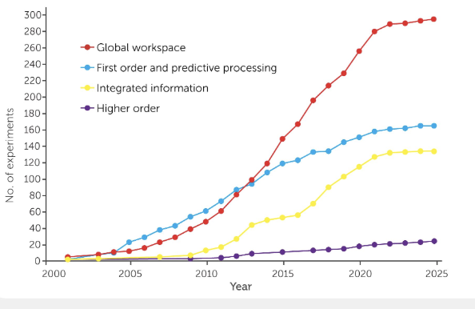

# Bibliographies

A curated collection of academic bibliographies focused on consciousness, artificial intelligence, and cognitive science.

## Overview

This repository contains organized bibliographies covering key topics in consciousness research, AI architectures, and foundational theories in cognitive science. The bibliographies are maintained as markdown files for easy reading and reference.

## Citation Format

Citations follow APA style where applicable, with DOIs and links to sources included when available. Note that citation formatting may vary slightly between files to accommodate different source types (journal articles, books, preprints, etc.).

## Seminar

The [`seminar/`](seminar/) folder contains bibliographies for specific seminar topics:

- **[philosophy-seminar-1-computationalism.md](seminar/philosophy-seminar-1-computationalism.md)** — Bibliography for Philosophy Seminar 1: Computationalism

## General

The [`general/`](general/) folder contains focused bibliographies on consciousness, AI, and related topics:

- **[theories-of-consciousness.md](general/theories-of-consciousness.md)** — Major theories of consciousness (GNWT, HOT, IIT, RPT, PP)

- **[meta-works-including-testability.md](general/meta-works-including-testability.md)** — Testability and methodology in consciousness science

- **[bach.md](general/bach.md)** — Joscha Bach's work on AI and consciousness

- **[foundational.md](general/foundational.md)** — Foundational papers on consciousness and cognitive science

- **[artificial-life.md](general/artificial-life.md)** — Artificial and computational life

- **[computationalism.md](general/computationalism.md)** — Computationalism and computational theory of mind

- **[deep-learning.md](general/deep-learning.md)** — Deep learning and neural networks

## Library

The [`library/`](library/) subfolder contains extensive bibliographies organized by discipline:

- **[Philosophy.md](library/Philosophy.md)** — 179 works (chronological from ancient to contemporary)
- **[Cybernetics.md](library/Cybernetics.md)** — 77 works (systems theory, complexity, information theory)
- **[Computer Science.md](library/Computer%20Science.md)** — 77 works (algorithms, programming, systems, AI)
- **[Psychology.md](library/Psychology.md)** — 18 works (cognitive, developmental, behavioral psychology)
- **[Computationalism.md](library/Computationalism.md)** — 69 works (computational theory of mind, connectionism, neurophilosophy, AI)
- **[Science Fiction.md](library/Science%20Fiction.md)** — 94 works (science fiction literature from 1920s to present)

## Usage

Each bibliography file contains citations in a consistent format with links to sources where available. Use these bibliographies as reference materials for research, literature reviews, or academic work in consciousness studies, AI, and cognitive science.

## Contributing

Contributions and suggestions for additional references are welcome. Please maintain the existing citation format and organizational structure when adding new entries.

## License

This repository is provided as-is for educational and research purposes. Individual works cited remain the property of their respective authors and publishers.
